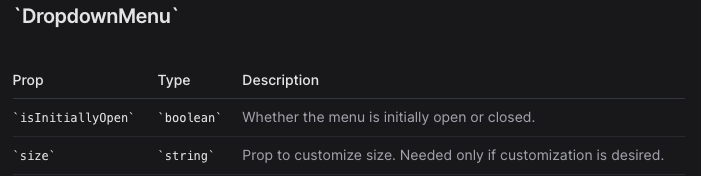

# Dropdown Menu

## Question

Design a dropdown menu component that can reveal a menu containing a list of actions.

## Requirements exploration

### Can there be multiple dropdown menus open at once?

Yes, there can be.

### What contents will the menu contain?

Only text, no focusable elements.

### Is there a maximum number of items allowed in the menu?

There's no fixed maximum, but preferably, there should not be more than 20 items for better user experience.

### What amount of flexibility does the user have in customizing the design?

Users should be able to customize colors, fonts, padding, etc to match their branding.

### What devices will this component be used on?

All devices — mobile, tablet, desktop.

## Architecture / high-level design

An example usage of the dropdown menu in React, with event handlers omitted.

```html
<DropdownMenu>
    <DropdownMenu.Button>Actions</DropdownMenu.Button>
    <DropdownMenu.List>
        <DropdownMenu.Item>New File</DropdownMenu.Item>
        <DropdownMenu.Item>Save</DropdownMenu.Item>
        <DropdownMenu.Item>Delete</DropdownMenu.Item>
    </DropdownMenu.List>
</DropdownMenu>
```


In React, components can communicate with its parents using context or props. We choose to use context here since we are using a composition model here and passing props is inconvenient. `<DropdownMenu>` should contain a context provider that provides the state values (see Data Model section) to all its child components.

## Data model

Note that for designing components, it might make sense to design the interface/API first or both data model and API concurrently. It depends on the component at hand. Feel free to jump between the two sections.


These state values are housed within `<DropdownMenu>` and provided to all components via React context.

See below for configuration options which are also part of the data model.

## Interface definition (API)

### General props

These props apply to most of the components.





## Optimizations and deep dive

### Rendering

Rendering the dropdown menu can be quite tricky due to the menu being "floating" and not exactly following the normal flow of page elements.

### Layout

There are two common ways to render the dropdown menu near the button. We've provided minimal code samples for each layout approach.

#### Relative to Button

In this approach, we wrap a `<div>` with position: relative around the `<button>` and the menu. The menu is using position: absolute which makes it positioned relative to its closest positioned ancestor, which is the root `<div>.`

This method is straightforward and does not require much calculation of elements and their positions to the page, but parent containers with overflow: hidden can possibly clip the menu and its contents, or there could be z-index issues.

This approach is used by Headless UI and Bootstrap.

#### Relative to Page

In this approach, the menu is rendered as a direct child of the `<body>` and positioned absolute-ly to the page by getting the element's `offsetTop` and `offsetLeft` to get the coordinates of the `<button>` relative to the page and adding its height (`offsetHeight`) to get the final Y position to render the menu.

In React, this can be done using React Portals, which lets you render outside the DOM hierarchy of the parent component. A typical use case for portals is when a parent component has an overflow: `hidden` or `z-index` style, but you need the child to visually "break out" of its container. Common examples include dropdown menus, tooltips, modals.

The downside of this approach is that if the window is resized or if contents of the page changes such that the height of the page is shorter than when the menu was first shown, the menu's position will be incorrect. As a workaround, you can watch the window for height changes and re-render the menu with the correct position.

This approach is used by Radix UI and Reach UI.

### Position

The component can also allow customization of alignment, in all directions around the `<button`>. Examples of left/right-aligned menu lists can be found in the example below. Supporting more alignments is a matter of finding the right values for top/left/right/bottom/CSS translations to use.

### Maximum height

Since there is no maximum allowable number of items in the menu, we can set a default maximum height for the menu such that the excess items can be accessed by scrolling within the menu. This height can also be customized.

### Rendering in HTML or JavaScript

The dropdown menu can either be :

1. Rendered into the HTML like Bootstrap's Dropdowns. The menu is initially hidden from view via `display: none` / `opacity: 0` / `hidden` attribute, and those styles are toggled when the menu is to be shown.
2. Rendered on the fly via JavaScript after the menu button is activated.

The pros of rendering in the HTML first is better runtime performance due to fewer DOM operations needed to show the menu. The downside is that the HTML can be unnecessarily bloated especially if the user never interacts with the dropdown menu at all. Since the menu items usually don't contribute towards SEO and there likely won't be that many elements, the benefits of rendering the menu beforehand in HTML are relatively minor.

### Automatic flipping when near the edge

Smart dropdown menus will know its position relative to the viewport and can flip itself when there is insufficient space to display the full menu in its current position. Reach UI's Menu has autoflipping implemented.

Optionally, scrolling can be disabled on the window when a menu is open (by adding `overflow: hidden` to `<body>`). This limits the user experience but avoids the need for automatic flipping which can be complicated to implement. Material UI's Menu component takes this approach.

The core idea here is to know how tall the menu will be and autoflip when the bottom of the menu will exceed the viewport's height.

-   **Viewport height**: `window.innerHeight`.
-   **Position of menu's bottom edge**: which is a combination of:
    1.  Button position relative to viewport (`buttonEl.getBoundingClientRect().y`)
    2.  Button height (`buttonEl.getBoundingClientRect().height`)
    3.  Menu height (`menuEl.getBoundingClientRect().height`)
    4.  Spacing between button and menu
