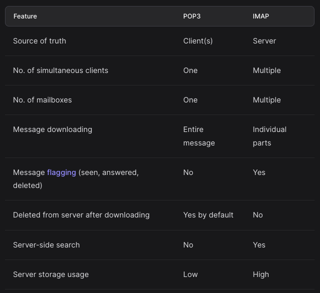
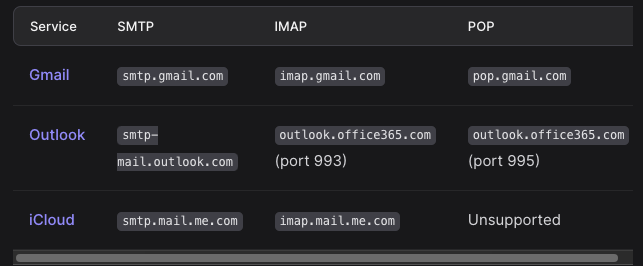
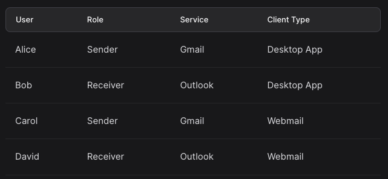
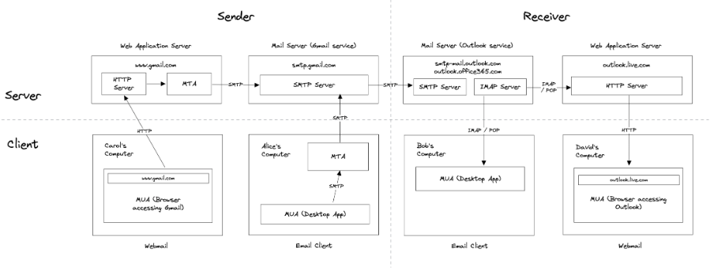

# Email Client (e.g. Microsoft Outlook)

## Question
Design a **desktop** email client that can send and receive email messages given an email provider service.

It's important to distinguish between **webmail** and email client apps. Websites like gmail.com, outlook.com, Yahoo Mail which allow you to use the browser to access email is called webmail. Email clients are desktop apps that have to be installed on your computer and can usually be used even when offline. They usually allow access to multiple email services like Gmail, Outlook, iCloud, etc and view messages from different services within the app.

*Note: Work in Progress!
The solution is still being worked on but we'd like to share the drafts so that interested users can still benefit from it in the meanwhile and provide feedback.*

## Requirements exploration
### What are the core functionalities needed?
- Sending email messages to an SMTP server.
- Retrieving email messages from an IMAP server.
- Access email messages already on the device.

### What operating systems does the app need to support?
The popular ones: Windows, macOS, and Linux/Ubuntu.

### What email services/accounts need to be supported?
We don't have to focus on that aspect for this question. Assume that the user can make authenticated requests to preconfigured SMTP/IMAP servers to send/retrieve emails successfully.

Many native desktop email clients like Apple Mail, Outlook, and Mailspring allow users to connect to multiple email services like iCloud Mail, Gmail, Exchange to show emails from multiple services within the app. However, that is beyond the scope for this question.

### Does the application need to work offline?
Yes, where possible. Outgoing email messages should be saved and sent out when the application goes online. Users should still be allowed to browse and search for emails on the device even if they are offline.

### Should emails between the same sender and topic be threaded?
Threading of message conversations will be good but not required.

## Background knowledge
Email client applications are quite different from your traditional web applications due to the fact that server requests are made using non-HTTP protocols like SMTP and IMAP. It is unlikely interviewers will require candidates to be familiar with how the common email protocols work, so you can assume you are working with HTTP-based APIs for sending and retrieving emails.

Nevertheless, we'll cover some fundamental email system concepts for the sake of learning.

### Parts of email systems
- **Mail User Agent (MUA)**: An application where users can compose, send, receive, and read email messages. Other non-core functionalities include searching, flagging, address books, etc. These can be desktop applications with graphical user interfaces (Outlook, Apple Mail), or command line programs.
- **Mail Transfer Agent (MTA)**: A software that transfers email messages from one host to another using the SMTP protocol. MTAs can exist on both users' devices and mail servers.
- **Mail Servers**: Computers which host the MTAs and stores the email messages in a mailbox.
- **Mailbox**: A mailbox is a conceptual entity that does not necessarily pertain to storage and is identified by an email address. It contains email messages and typically exists on mail servers.

### Mail transport protocols
If you have set up email clients before, you might have come across the terms SMTP, POP and IMAP. SMTP is an outgoing email protocol used to send messages while POP and IMAP are incoming email protocols that email servers support to allow clients to retrieve messages.

The benefit of having standardized protocols for sending and retrieving messages is that email services can send messages between each other and email clients can connect to any email service.

#### Simple Mail Transport Protocol (SMTP)
[Simple Mail Transport Protocol](https://en.wikipedia.org/wiki/Simple_Mail_Transfer_Protocol) is a protocol for sending email messages over the internet used by mail servers, MTAs, and MUAs (non-webmail).

SMTP uses a simple set of commands to transfer messages, including commands to authenticate the sender, specify the recipient(s), and sending the message.

Nylas discussed about SMTP relays in detail in their blog post "[SMTP vs. Web API: The Best Methods for Sending Email](https://www.nylas.com/blog/smtp-vs.-web-api-the-best-methods-for-sending-email/)". Here's an [example SMTP conversation](https://en.wikipedia.org/wiki/Simple_Mail_Transfer_Protocol#SMTP_transport_example) with an SMTP server over the command line. Lines starting with `S:` are sent from the server and line starting with `C:` are written from the user.

```
$ openssl s_client -connect smtp.example.com:465 -crlf

S: 220 smtp.example.com ESMTP Postfix
C: HELO relay.example.org
S: 250 Hello relay.example.org, I am glad to meet you
C: AUTH LOGIN
S: 334 VXNlcm5hbWU6
C: dXNlcm5hbWUuY29t # Username encoded in Base64
S: 334 UGFzc3dvcmQ6
C: bXlwYXNzd29yZA== # Password encoded in Base64
S: 235 Authentication succeeded
C: MAIL FROM:<bob@example.org>
S: 250 Ok
C: RCPT TO:<alice@example.com>
S: 250 Ok
C: RCPT TO:<theboss@example.com>
S: 250 Ok
C: DATA
S: 354 End data with <CR><LF>.<CR><LF>
C: From: "Bob Example" <bob@example.org>
C: To: "Alice Example" <alice@example.com>
C: Cc: theboss@example.com
C: Date: Tue, 15 Jan 2008 16:02:43 -0500
C: Subject: Test message
C:
C: Hello Alice.
C: This is a test message with 5 header fields and 4 lines in the message body.
C: Your friend,
C: Bob
C: .
S: 250 Ok: queued as 12345
C: QUIT
S: 221 Bye
{The server closes the connection}
```

Specification of SMTP can be found in RFC5321.

#### Post Office Protocol (POP)
Post Office Protocol is a traditional standard protocol for accessing email messages on a mail server. Messages are kept on the server only until the first device accesses and downloads them. As the name suggests, once an email is downloaded, it is usually deleted from the server, just like how post offices act as temporary storage for physical mail before they get delivered to recipients.

POP3 is the most recent widely-used version of POP but is older than newer protocols like IMAP and less feature. POP is generally considered less desirable than IMAP as it is less flexible and does not allow for server-side searching or message flagging.

The specification for POP3 can be found in RFC1939.

#### Internet Message Access Protocol (IMAP)

[Internet Message Access Protocol](https://en.wikipedia.org/wiki/Internet_Message_Access_Protocol) is a standard protocol for accessing email messages on a mail server with the latest version being IMAP4. IMAP allows users to retrieve and manage their email messages within webmail and email clients, without having to download them to the local computer. IMAP also allows users to access their email from multiple devices and locations, and provides features such as server-side searching and message flagging.

IMAP addresses many of the shortcomings of POP, at the cost of server storage. Nylas published a deep dive into IMAP on their engineering blog which we highly recommend checking out.

The specification for IMAP4 can be found in RFC3501.

#### POP vs IMAP
Here's a table comparing the POP (POP3) and IMAP (IMAP4) protocols.



*Reference: [IMAP vs. POP3: What's the Difference? Which One Should You Use?](https://www.makeuseof.com/tag/pop-vs-imap/)*

It is an expectation to access emails on multiple devices today and view a consistent mailbox state across different client devices, so POP's model is outdated. The main advantage of POP is that less server storage space is needed, but that is usually not a concern these days since storage is relatively cheap.

IMAP is the prevalent email protocol in the current age but many email clients still support retrieving emails from both IMAP and POP servers.

### Email server configurations
Popular email services have the following configurations.



### Email Flow
Let's assume the following users with the respective roles, services, and types of clients:



We'll go through the flows detailing how messages are sent between the various types of clients.



#### Important notes:

- Mail services can be running SMTP servers and IMAP/POP servers on the same machine or on different machines. The decision is not important for our discussion as long as the servers for a mail service have access to the same email message database.
- The arrows directions indicate the flow of the email message, and not the origin of the request. IMAP/POP requests are initiated by clients, not pushed from the mail servers.
- Gmail's IMAP servers are not shown because in the above scenario, Gmail is only used for sending and not receiving.
- The DNS lookup stage for the MX (Mail Exchange) record is omitted for simplicity. SMTP servers use the domain name of the recipient's email address to look up DNS records for that domain (MX records in particular) to determine the address of the mail server.
- MTAs are pretty general terms but they all use SMTP to send messages. SMTP servers are MTAs.

#### Email client -> Email client
1. Alice (`alice@gmail.com`) wants to send an email to Bob (`bob@outlook.com`).
2. Alice's email client desktop app sends the message to the MTA, a software running on her computer.
3. Alice's computer's MTA sends the message to Gmail's SMTP server (`smtp.gmail.com`) over SMTP.
4. Gmail's SMTP servers send the message to Outlook's SMTP servers (`smtp-mail.outlook.com`) over SMTP and the message is saved into Outlook's database.
5. Bob's email desktop client makes IMAP requests to Outlook's IMAP servers (`outlook.office365.com:993`).
6. Outlook's IMAP servers retrieve the message from the database and send it back to Bob's desktop client over IMAP.
7. Bob's email desktop client displays the new email message from Alice.

#### Email client -> Webmail
1. Alice (`alice@gmail.com`) wants to send an email to David (`david@outlook.com`).
2. Alice's email client desktop app sends the message to the MTA, a software running on her computer.
3. Alice's computer's MTA to send the message to Gmail's SMTP server (`smtp.gmail.com`) over SMTP.
4. Gmail's SMTP servers send the message to Outlook's SMTP servers (`smtp-mail.outlook.com`) over SMTP and the message is saved into Outlook's database.
5. David accesses Outlook webmail by visiting `https://outlook.live.com` in his browser.
6. The servers hosting `outlook.live.com` makes IMAP requests to Outlook's IMAP servers (`outlook.office365.com:993`).
7. Outlook's IMAP servers retrieve the message from the database and send it back to outlook.live.com.
8. The servers hosting outlook.live.com sends the response to David's browser over HTTP.
9. David's browser displays the new email message from Alice.

#### Webmail -> Email client
- Carol (`carol@gmail.com)` wants to send an email to Bob (`bob@outlook.com`).
- Carol accesses Gmail webmail by visiting https://www.gmail.com in her browser.
- Carol sends out an email message from Gmail webmail, which makes a HTTP request to gmail.com servers.
- gmail.com servers uses its MTA software to send the message to Gmail's SMTP server (`smtp.gmail.com`) over SMTP.
- Gmail's SMTP servers send the message to Outlook's SMTP servers (`smtp-mail.outlook.com`) over SMTP and the message is saved into Outlook's database.
- Bob's email desktop client makes IMAP requests to Outlook's IMAP servers (`outlook.office365.com:993`).
- Outlook's IMAP servers retrieve the message from the database and send it back to Bob's desktop client over IMAP.
- Bob's email desktop client displays the new email message from Carol.

#### Webmail -> Webmail
- Carol (`carol@gmail.com)` wants to send an email to David (`david@outlook.com`).
- Carol accesses Gmail webmail by visiting` https://www.gmail.com` in her browser.
- Carol sends out an email message from Gmail webmail, which makes a HTTP request to gmail.com servers.
- gmail.com servers uses its MTA software to send the message to Gmail's SMTP server (`smtp.gmail.com`) over SMTP.
- Gmail's SMTP servers send the message to Outlook's SMTP servers (`smtp-mail.outlook.com`) over SMTP and the message is saved into Outlook's database.
- David accesses Outlook webmail by visiting `https://outlook.live.com` in his browser.
- The servers hosting outlook.live.com makes IMAP requests to Outlook's IMAP servers (`outlook.office365.com:993`).
- Outlook's IMAP servers retrieve the message from the database and send it back to outlook.live.com over IMAP.
- The servers hosting outlook.live.com sends the response to David's browser over HTTP.
- David's browser displays the new email message from Carol.

### Types of email systems

#### Email systems can be broadly categorized into the following types:

Store and forward servers
Store and forward email servers usually run on POP, where messages are kept on the server only until a user first accesses and downloads them. It is a simple and straightforward design.

#### Advantages

- Messages do not remain on the server for long (until a client accesses them) and server doesn't need to do much processing on them.
- Client devices usually store the downloaded messages, so users can still access old messages even when there is no internet connection, the mail server is unavailable due to outages.
- Server does not require much storage space as messages are deleted after downloading.

#### Disadvantages

- Since messages are stored locally, if the server is accessed from multiple client devices, there's no consistent view for all the messages.
- Users are responsible for backing up and restoring their messages. Without any backup, messages will be lost forever if devices are spoilt/stolen.
- Functionality such as searching/sorting of messages has to be done locally on the device, which can be computationally intensive for mailboxes containing large amount of messages. In the case of messages being stored across multiple devices, searching is only within the messages on the current device which can be inconvenient.

### Server-only mailboxes
In such system, servers act as the source of truth for the messages and even after clients download the messages, the server retains them. Clients do not cache or persist the messages after downloading them. Such servers can run on IMAP and webmail is a common example of such a model.

#### Advantages

- All devices have a consistent view of the mailboxes.
- Backups can be done by the email service providers without users going through any hassle.
- Functionality that can be computationally intensive or difficult to be done by clients can be performed on the server. Less powerful devices like mobile phones will benefit from this.

#### Disadvantages

- Requires internet connection to view the messages.
- Sufficient server storage space is required as it is the source of truth for messages.

### Server mailbox with client-side cache
A hybrid model combines the best characteristics of both the store and forward servers and the server-only mailbox by having a permanent server mailbox with clients caching/persisting the downloaded messages. Most desktop email clients operate using this model and is the most complex out of the above.

#### Advantages

- Most advantages of store and forward model:
- Can access messages even when offline or the email server is unavailable.
- Advantages of server-only mailboxes:
- All devices have a consistent view of the mailboxes.
- Backup done by email service providers.
- Leverage server-side features like searching.

#### Disadvantages

- Complex synchronization logic between client and server.
- Sufficient server storage space is required as it is still the source of truth for messages.

*Reference: [NinjaMail: the Design of a High-Performance Clustered, Distributed E-mail System](https://people.eecs.berkeley.edu/~kubitron/papers/ninja/pdf/ninjamail-workshop.pdf)*

### Native HTML apps
- How to build native apps
- Talk about examples (Electron/Nativefier/Tauri) and their differences:

## Architecture / high-level design

### Desktop client vs Webmail
- Separate into Client app vs Isomorphic core.
- Abstract out database layer so can select db depending on runtime environment.
- Values of a native desktop app:
	- Menubar
	- Notifications
	- Keyboard shortcuts that don't conflict with the browser's
	- Badge

### Flux/Redux architecture
Use a Flux architecture reducer architecture/Command query request separation. Many different actions in the application which can be abstracted out as application-wide commands and have multiple trigger sources (e.g. UI element interaction, File menu interaction, Keyboard shortcut).

- Central store. Many parts of the UI rely on the same data store.
- Namespaced commands for better organization and lower chance of collision.
- Easily implement undo/redo.
- [Mailspring's list of actions](https://github.com/Foundry376/Mailspring/blob/master/app/src/flux/actions.ts)

### Server-side rendering vs Client-side rendering
- CSR because it's an app.

### Task queue
- Mutable operations will update the local data store immediately, and queue changes to sync back to your mail provider.

## Data model
Work-in-progress

## Interface definition (API)
Work-in-progress

## References
- [http://www.slate.com/articles/technology/technology/2015/02/email_overload_building_my_own_email_app_to_reach_inbox_zero.html](https://www.slate.com/articles/technology/technology/2015/02/email_overload_building_my_own_email_app_to_reach_inbox_zero.html)
- [https://people.eecs.berkeley.edu/~kubitron/papers/ninja/pdf/ninjamail-workshop.pdf](https://people.eecs.berkeley.edu/~kubitron/papers/ninja/pdf/ninjamail-workshop.pdf)
- [https://github.com/nylas/nylas-mail](https://github.com/nylas/nylas-mail)
- [https://en.wikipedia.org/wiki/Internet_Message_Access_Protocol](https://en.wikipedia.org/wiki/Internet_Message_Access_Protocol)
- [https://www.rfc-editor.org/rfc/rfc3501](https://www.rfc-editor.org/rfc/rfc3501)
- [https://github.com/Foundry376/Mailspring](https://github.com/Foundry376/Mailspring)
- [https://web.dev/mailru-cwv/](https://web.dev/case-studies/mailru-cwv)
- [https://zapier.com/blog/best-email-client-for-mac/](https://zapier.com/blog/best-email-client-for-mac/)
- [Email Architecture, Gmail two Step Verification, SMTP POP3 IMAP](https://www.electroniclinic.com/email-architecture-gmail-two-step-verification-smtp-pop3-imap/)
- [Email Program Classifications](https://web.mit.edu/rhel-doc/5/RHEL-5-manual/Deployment_Guide-en-US/s1-email-types.html)
- [How does email work?](https://www.namecheap.com/support/knowledgebase/article.aspx/10589/2179/how-does-email-work/)


