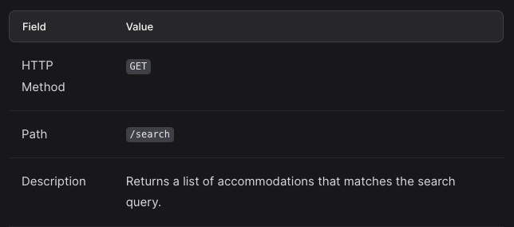
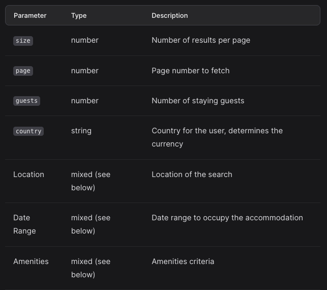
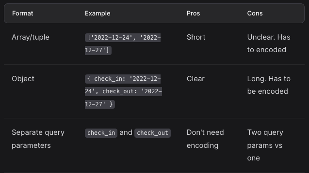
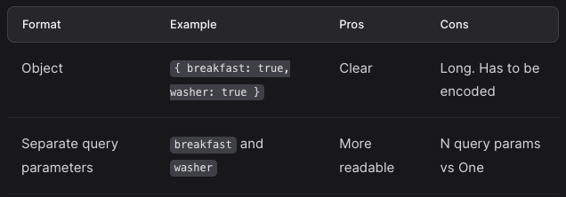
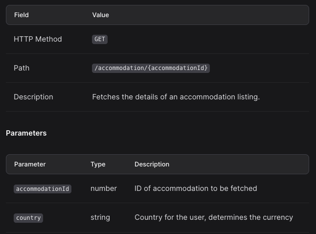
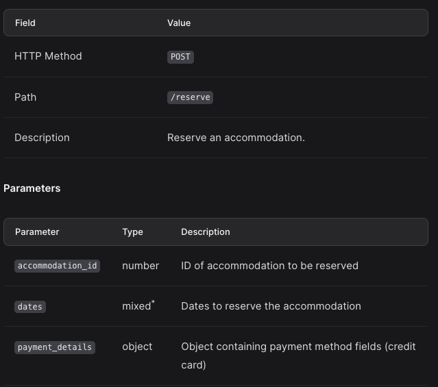

# Travel Booking (e.g. Airbnb)

## Question
Design a travel booking website that allows users to search for accommodations and make a reservation.

## Requirements exploration
### What are the core features to be supported?
- Search and browse accommodation listings.
- Viewing accommodation details such as price, location, photos, and amenities.
- Make reservation for accommodations.
### What does the user demographics look like?
International users of a wide age range: US, Asia, Europe, etc.

### What are the non-functional requirements?
Each page should load under 2 seconds. Interactions with page elements should respond quickly.

### What devices will the website be used on?
All possible devices: laptop, tablets, mobile, etc.

### Do users have to be signed in?
Anyone can search for listings and browse details but users need to logged in to make a booking.

### Summary
From the above, we can gather that the most important aspects of the website are:

- **Search engine optimization**: Travel sites should aim to rank high on search engines since organic search is one of the primary discovery mechanisms.
- **Performance**: Performance is known to affect conversions. For websites where the aim is to get customers to make purchases, performance is very important.
- **Internationalization**: The users are from many different countries and from various age groups. To capture a larger market, the website should be translated and localized.
- **Device support**: The site should work well for a variety of devices since the user demographics is very broad.

The requirements and nature of a travel booking website are very similar to E-commerce website system design, so there is a high degree of overlap between the solutions. In this solution we will cover the unique aspects of travel booking websites which aren't found on e-commerce websites.

## Architecture / high-level design

### Server-side rendering (SSR) or Client-side rendering?
Like E-commerce website system design, performance and SEO are critical. Hence server-side rendering is a must because of the performance and SEO benefits.

### Single-page application (SPA) or Multi-page application (MPA)?
Many travel sites intentionally open the listing details in a new tab/window so as to preserve convenient access to the search results page. Because new pages are often opened, the initial load performance matters more than subsequent navigation performance. The website also doesn't benefit as much from being a single page app architecture as the most commonly navigated pages cannot reuse the app shell and existing client state.

Hence the most important thing is that SSR is being used, whether the site is an SPA or MPA doesn't matter as much and both can be viable depending on how important the subsequent navigation experience is. In the modern web ecosystem, travel websites are one of the few products where an MPA architecture is still viable.

However, travel websites have a fair bit of interaction (e.g. changing search filters, interacting with the map, expanding accommodation details, etc.). Using UI frameworks is crucial for writing maintainable client side code. React, Vue, and Angular are top choices for doing so.

For an SSR + interaction-heavy use case, we can leverage universal/isomorphic rendering (or SSR with hydration). In universal rendering, the server renders the full initial HTML but after that, rendering and navigation becomes client-side. JavaScript event handlers are attached to the interactive elements within the HTML (hydration).

Airbnb is one of the pioneers of building universal/isomorphic apps with the invention of Rendr, a library that renders Backbone.js apps on the client and the server. Rendr is no longer being used these days with the rise of React and Next.js. Next.js which is the most popular choice for building universal React-powered web apps that desire server-side rendering with hydration.

### What top travel booking sites use
Let's take a look at the top travel booking sites in the wild and their rendering choices:


**All the top travel booking sites in the world use SSR and React!** This shows the importance of SSR for travel sites and the dominance of React in the industry. Half of these sites use MPA, probably because using an SPA + SSR combination is additional complexity that might not be worth dealing with.

For simplicity, and since SPAs are covered commonly in other questions, the discussion below assumes that we'll be using an MPA architecture with server-side rendering + hydration due to the need for interactivity after initial load.

### References

- [Rearchitecting Airbnb's Frontend | Airbnb Engineering Blog](https://medium.com/airbnb-engineering/rearchitecting-airbnbs-frontend-5e213efc24d2)
- [Server Rendering, Code Splitting, and Lazy Loading with React Router v4 | Airbnb Engineering Blog](https://medium.com/airbnb-engineering/server-rendering-code-splitting-and-lazy-loading-with-react-router-v4-bfe596a6af70)
- [Rendr: Run your Backbone apps in the browser and Node | Airbnb Engineering Blog](https://medium.com/airbnb-engineering/rendr-run-your-backbone-apps-in-the-browser-and-node-a3481af49312)
- [Isomorphic JavaScript: The Future of Web Apps | Airbnb Engineering Blog](https://medium.com/airbnb-engineering/isomorphic-javascript-the-future-of-web-apps-10882b7a2ebc)
- [Breaking the Monolith — Modular redesign of Agoda.com | Agoda Engineering & Design](https://medium.com/agoda-engineering/breaking-the-monolith-f3538d9c3ad6)

## Data model


We have omitted the entities related to payments and addresses since they are covered in E-commerce website system design. If the interviewer wants you to focus on the checkout flow as well, do mention those entities.

## Interface definition (API)
We will need the following HTTP APIs:

- Search: Fetch accommodation listings given some search/filter parameters. The results are rendered on the map and/or a list view.
- Listing details: Fetch the details for an accommodation listing.
- Reserve: Make a reservation for an accommodation.

### Search accommodations



#### Parameters



**Location**: The exact format of the `location` field depends on the business requirements. But in general, we need to tell the server the desired boundary so that results within the boundary will be shown. There are two common ways to represent boundaries: (1) Center position + radius, (2) Boundary coordinates.

1. **Center position + radius**. The radius can be in miles/km and the center position can be either of:
	- **Free text search**: This is any string containing a location e.g. "San Francisco", "New York City". An external location service will be needed to convert the string into geographic coordinates (via geocoding). Geocoding is preferably done on the server to prevent API abuse.
	- **Geolocation/Coordinates**: This format is useful for map-based UIs where users can pan/zoom the map to search for listings within the area or when users allow the app to access current location to search around them.
2. **Boundary coordinates**. For map-based UIs, we can use the coordinates of the 4 corners of the presented map as the boundary area.

It's likely that the search API will have to support both formats if the website has different search UIs:

- Landing pages for travel sites usually have a search bar with the compulsory parameters like date range and number of guests. Such UI will need the free text search location format.
- Results pages with maps will use the geolocation/boundary coordinates format.

**Date Range**: There are several date range formats to choose from and neither are clear winners:



The array format is the least clear out of the three, and the object requires encoding to be used in `GET`, so separate query parameters would be the most recommended.

**Amenities**: Putting the query parameters for amenities has the same issues with date range.



For this case, due to the sheer number of query parameters if each amenity criterion is a separate query parameter, the object format is better because:

- Putting each criterion in the query parameter makes the query string really long and the hierarchy is lost.
- There's a possibility of query parameter name collision with the non-amenities fields. This can be solved be prefixing all the amenity fields with `amenities_` (e.g. `amenities_breakfast` and `amenities_washer`).
- Moreover, some amenities criteria have non-primitive values which will require URL encoding and decoding anyway.

There's no fixed standard on [how to encode arrays and objects into the query string of URLs](https://stackoverflow.com/questions/6243051/how-to-pass-an-array-within-a-query-string) and the format tend to be implementation dependent. The most important thing to note is for a consistent format between the server and the client.

#### Sample response

```js
{
  // Pagination metadata.
  "pagination": {
    "size": 5,
    "page": 2,
    "total_pages": 15,
    "total": 74
  },
  "results": [
    {
      "id": 561602, // Accommodation ID.
      "title": "Great view in the Mission, 15 mins by bus downtown",
      "images": [
        "https://www.greathotels.com/img/1.jpg",
        "https://www.greathotels.com/img/2.jpg",
        "https://www.greathotels.com/img/3.jpg",
        "https://www.greathotels.com/img/4.jpg"
      ],
      "rating": 4.82,
      "coordinates": {
        "latitude": 37.74403,
        "longitude": -122.41755
      },
      "price": 200,
      "currency": "USD"
    }
    // ... More accommodation results.
  ]
}
```

We use offset-based pagination here as opposed to cursor-based pagination because:

- Having page numbers is useful for navigating between search results and jumping to specific pages.
- Accommodations results do not suffer from the stale results issue that much because new listings are not added that quickly/frequently.
- It's useful to know how many total results there are.
For a more in-depth comparison between offset-based pagination and cursor-based pagination, refer to the News Feed system design article.

If infinite scroll is desired, then a cursor-based pagination approach might be required. Offset-based pagination can still be used, but the client will need to go through the trouble of filtering out duplicated results.

### Fetch accommodation details
Strictly speaking, if the accommodation details page is always opened in a new tab, then the details data will only ever be needed to be fetched on the server to create the initial HTML; it will not be fetched from the client, so a standalone HTTP API is not needed.



#### Sample response

```js
{
  "id": 561602, // Accommodation ID.
  "title": "Great view of Brannan Street, 15 mins by bus downtown. Bed and Breakfast provided!",
  "images": [
    "https://www.greathotels.com/img/1.jpg",
    "https://www.greathotels.com/img/2.jpg",
    "https://www.greathotels.com/img/3.jpg",
    "https://www.greathotels.com/img/4.jpg"
  ],
  "rating": 4.82,
  "coordinates": {
    "latitude": 37.74403,
    "longitude": -122.41755
  },
  "price": 200,
  "currency": "USD",
  "amenities": {
    "breakfast_provided": true,
    "internet": true,
    "washer": true,
    "dryer": false
    // Any additional amenities details.
  },
  "house_rules": "...",
  "contact_email": "..."
  // Any additional details.
}
```

### Make reservation



* The format of the `dates` field should be consistent with the selected date range format in the search API.

### Sample response
A reservation object is returned upon successful reservation.


```js
{
  "id": 456, // Reservation ID.
  "total_price": 400,
  "currency": "USD",
  "dates": {
    "check_in": "2022-12-24",
    "check_out": "2022-12-27"
  },
  "accommodation": {
    "id": 561602,
    "address": {
      "country": "US",
      "street_address": "888 Brannan Street",
      "city": "San Francisco",
      "zip": "94103",
      "state": "CA",
      // ... Other address fields.
    },
  }
  "payment_details": {
    // Only show the last 4 digits.
    // We shouldn't be storing the credit card number
    // unencrypted anyway.
    "card_last_four_digits": "1234"
  }
}
```

## Optimizations and deep dive
To recap, the most important aspects of a travel booking website are: **search engine optimization, internationalization, performance, and device support.**

### Search engine optimization (SEO)

#### Bookmarkable search results
When searching on these travel sites, notice that the search query and filter will be reflected in the URL. If you load the URL in a new window, the same results and search query are shown. Syncing the search query with the URL is an important feature because:

1. Allows the particular search to be bookmarked, which is a common action users do when doing research for travel.
2. Other sites like travel blogs to link to the results page of specific search filters (e.g. vacations rentals in San Francisco). This helps to improve the site's SEO and discoverability.

### Pre-generate pages for popular searches
When you search for "Vacation in San Francisco" in a search engine, you will most likely see results from popular travel sites like Expedia, Airbnb, TripAdvisor, among many others. These pages aren't content articles; they're the site's search results page with some pre-filled filters. How is this accomplished?

To improve SEO by appearing relevant to what users are searching, travel sites generate tons of pages for the popular search terms that shows relevant listings for these terms. For example, Airbnb generated dedicated pages for "Vacation rental apartments in San Francisco" and "Vacation rental apartments in New York. To let search engines know about these dedicated pages, [Airbnb has a sitemap page](https://www.airbnb.com/sitemaps/v2) just for listing links to their dedicated listing pages. There are thousands or more listings.

Notice that the URLs of these dedicated pages are readable:

- Readable URLs: https://www.airbnb.com/san-francisco-ca/stays
- "Ugly" URLs: https://www.airbnb.com/search?location=123 (where 123 is an internal ID mapping to San Francisco city)

Having readable URLs helps with SEO rankings, especially if the URL contains the search term itself.

With this technique, search engines will think that travel sites have many different content pages when in reality they are all rendering the same results page but with different listings. It's great for SEO.

### Dynamic rendering – serve crawlers different pages
Sites can also leverage [dynamic rendering](https://developers.google.com/search/docs/crawling-indexing/javascript/dynamic-rendering), Dynamic rendering involves using a web server to differentiate between requests made by crawlers and those made by users. When a request is made by a crawler, it is routed to a renderer that generates a version of the content that is optimized for the crawler, such as a static HTML version. Requests made by real users are handled as normal.

Dynamic rendering can be done in a different manner as well. For [Expedia Group's Vrbo](https://medium.com/expedia-group-tech/improving-vrbo-homepage-loading-experience-e4b2207535f4), crawlers are served a full page while real users are served only a lightweight page and content above the fold, the rest of the content is loaded async on the client.

### Internationalization (i18n)
Some of the following is extracted from our Quiz Questions on internationalization:

- Have dedicated pages translated in the supported languages.
- Make the language and country selector very prominent (e.g. in the navbar).
- For listing details which are contributed by users, add an automatic translation feature so that users visiting country X but don't speak country X's language can understand the listing in their native language.
- Set the `lang` attribute on the `html` tag (e.g. `<html lang="zh-cn">`) to tell browsers and search engines the language of the page which helps browsers offer a translation of the page. This is also important for SEO.
- Enable locale-specific UI:
	- Using the :lang() CSS pseudo-class to change display
	- Right-to-left languages`
		- Using CSS Logical Properties
		- HTML's [`dir` attribute](https://developer.mozilla.org/en-US/docs/Web/HTML/Global_attributes/dir)
		- CSS direction: `rtl`
- Consider differences in the length of text in different languages.
- Do not concatenate translated strings.
- Do not put text in images.
- Be mindful of how colors are perceived in different cultures.

### Performance
Performance is known to affect conversions, so for websites where the aim is to get customers to make bookings, performance is important. Performance optimizations have been covered in great detail in the earlier questions, so in this question we will list out the relevant performance optimizations along with blog articles by companies should you want more details.

### Image optimizations
- **Image carousel**: Photos are widely used on travel websites to showcase how attractive the destination/accommodation is. We have covered implementation of image carousels in the Image Carousel system design article.
- **Image preloading/lazy loading**: One super useful technique is to use JavaScript to have fine-grain control when images load.
	- [Airbnb optimized the image carousel experience in their room listings with a combination of lazy loading and preloading behavior](https://medium.com/airbnb-engineering/building-a-faster-web-experience-with-the-posttask-scheduler-276b83454e91):
		- Initially, only the first image is loaded (the remaining images will be lazily loaded).
		- The second image is preloaded when the user shows possible intent of viewing more images:
			- Cursor hovers over the image carousel.
			- Focuses on the "Next" button via tabbing.
			- Image carousel comes into view (on mobile devices).
		- If the user does view the second image (which signals high intent to browse even more images), the next three images (3rd to 5th) are preloaded.
		- As the user clicks "Next" again to browse more images, the (n + 3)th image is preloaded.
- **Responsive images**: Serving the most suitable image for the device.
	- [Images on the Web: Part 1 — Responsive Images | Expedia Group Technology](https://medium.com/expedia-group-tech/images-on-the-web-part-1-responsive-images-5dc0066461bd)
	- [Images on the Web: Part 2 — Implementing responsive images | Expedia Group Technology](https://medium.com/expedia-group-tech/images-on-web-part-2-implementing-responsive-images-ca1d30f533f8)
- **Image formats**: Use webp format for photos and SVGs for icons where possible.

### Code splitting
- [Expedia's Vrbo prioritizes above-the-fold contents and loads code for it first.](https://medium.com/expedia-group-tech/improving-vrbo-homepage-loading-experience-e4b2207535f4)
- Page/route-level code splitting to prevent huge JavaScript bundles if using a single-page app architecture.
- Lazy load UI components that are not shown on initial render: (1) below the fold elements (e.g. footer), (2) elements that only appear after interaction (e.g. popover, modal).

### Performance monitoring
- Use tools like Lighthouse and Web Vitals to profile websites and measure performance.
- Airbnb came up with their own [Page Performance Score](https://medium.com/airbnb-engineering/creating-airbnbs-page-performance-score-5f664be0936) and [defined the metrics which mattered for web performance](https://medium.com/airbnb-engineering/measuring-web-performance-at-airbnb-122da8d3ea3f).
- Set up performance budgets that run on CI.

### React-specific tips
- React-specific performance optimizations done by Airbnb: [React Performance Fixes on Airbnb Listing Pages | The Airbnb Tech Blog](https://medium.com/airbnb-engineering/recent-web-performance-fixes-on-airbnb-listing-pages-6cd8d93df6f4)
- [12 Tips to Improve Client Side Page Performance | Expedia Group Technology](https://medium.com/expedia-group-tech/12-tips-to-improve-client-side-page-performance-88c7bec27933)

### Bundling optimizations
- [Module federation: Using Webpack Module Federation to Create an App Shell | Expedia Group Technology](https://medium.com/expedia-group-tech/using-webpack-module-federation-to-share-an-app-shell-7d23633510e)
- [Optimizing a Page: Resource Hints, Critical CSS, and Webpack | Expedia Group Technology](https://medium.com/expedia-group-tech/optimize-a-page-resource-hint-critical-css-webpack-c8cc7319fb87)

### Virtual list/windowing for long lists with infinite scrolling
Use virtual list/windowing for long lists with infinite scrolling. Read more about [List Virtualization on patterns.dev](https://www.patterns.dev/vanilla/virtual-lists)

### Progressive web apps
[Progressive Web Apps with Service Workers | Booking.com Engineering](https://medium.com/booking-com-development/progressive-web-apps-with-service-workers-887e80abf9ef)

### Other performance tips
- When using client-side rendering, split up listing response into multiple payloads so as to show results faster. To quickly show results, the response payload can be split into a few chunks, e.g. returning the first 5 results (or whichever many that are above the fold), then loading the rest of the results on the page after that.
- [Web Applications: Analyzing Client-Side Performance | Expedia Group Technology](https://medium.com/expedia-group-tech/web-applications-analyzing-client-side-performance-37e9cc4ad86b)
- [Go Fast or Go Home: The Process of Optimizing for Client Performance](https://medium.com/expedia-group-tech/go-fast-or-go-home-the-process-of-optimizing-for-client-performance-57bb497402e)

### Further reading
- [What kind of things must you be wary of when designing or developing for multilingual sites?](https://www.greatfrontend.com/questions/quiz/designing-or-developing-for-multilingual-sites)
- [How do you serve a page with content in multiple languages?](https://www.greatfrontend.com/questions/quiz/how-do-you-serve-a-page-with-content-in-multiple-languages)
- [Building Airbnb's Internationalization Platform](https://medium.com/airbnb-engineering/building-airbnbs-internationalization-platform-45cf0104b63c)
- [Adding support for Arabic and Hebrew languages on Airbnb](https://medium.com/airbnb-engineering/adding-support-for-arabic-and-hebrew-languages-on-airbnb-355f35a4e6b7)

### Device support
- **Responsive images**: Serving the most suitable image for the device, as mentioned in the image optimization section above.
	- [Images on the Web: Part 1 — Responsive Images | Expedia Group Technology](https://medium.com/expedia-group-tech/images-on-the-web-part-1-responsive-images-5dc0066461bd)
	- [Images on the Web: Part 2 — Implementing responsive images | Expedia Group Technology](https://medium.com/expedia-group-tech/images-on-web-part-2-implementing-responsive-images-ca1d30f533f8)
- **Device-specific UI**: Showing different UI for different devices, which can involve using a totally different information architecture.
	- Dynamic number of result items in a row and per page depending on device width and height.
	- Since maps are hard to use on smaller devices due to the smaller screen estate, consider not having a map UI at all. Without the map, clients can avoid loading map code and textures entirely on mobile devices.
	- Airbnb's listings are more app-like on mobile with a floating bottom bar. The listing page also does not open listings on a new page, presumably because it is harder to manage many open tabs on mobile.
	- Support swiping on image carousels on mobile.
	- Less aggressive preloading strategy on mobile since mobile data can be more expensive.
	- Interactive elements should be larger on mobile.

### User experience
#### Preserving search context
For most travel sites, clicking on the listings will open the listing details in a new tab. The reason to do so is because users tend to browse multiple listings after narrowing down the search results and opening the listing details in a new page allow users to easily dive into the details of a listing and go back to where they left off if the listing didn't meet their expectations or if they want to see other listings.

The alternative is to open the listing details within a full-screen modal on the same page and shallowly updating the URL (via `History.pushState()` similar to Zillow.com and Instagram.com. Dismissing the modal will reveal the search results behind and users can continue browsing the results. The downside of this approach is that it is more complicated to implement and will require more JavaScript on the client since everything is on one single page and the listing details need to be fetched via AJAX.

### Accessibility
- Image `alt` tags: If there are no descriptions provided for images uploaded by users, it's ok to have empty `alt` tags.
- [Expedia Accessibility Guidelines](https://accessibility.expedia.biz/pages/exagindex) covers topics like Color, Controls, Keyboard and Input Modalities, Forms, Images, Content Structure, Reading Order and Navigation Order, etc.

### Form optimizations
Form optimizations have been covered in detail in E-commerce website system design. To recap:

- Country-specific address/payment Forms.
- Optimize autofill experience.
- Show error messages.
- Clear focus states.
- Read more about building good Payment forms and general form best practices on web.dev.

### Other topics
- Map
	- Markers which are in close proximity can be [clustered together](https://developers.google.com/maps/documentation/javascript/marker-clustering)
- Whitelabelling
	- [Building and scaling different travel websites with one codebase | Agoda Engineering & Design](https://medium.com/agoda-engineering/building-and-scaling-different-travel-websites-with-one-codebase-fc6f0202c2e1)
	- [Managing and scaling different white label development and testing environments | Agoda Engineering & Design](https://medium.com/agoda-engineering/managing-and-scaling-different-white-label-development-and-testing-environments-4e90748fcb3b)
- Testing


