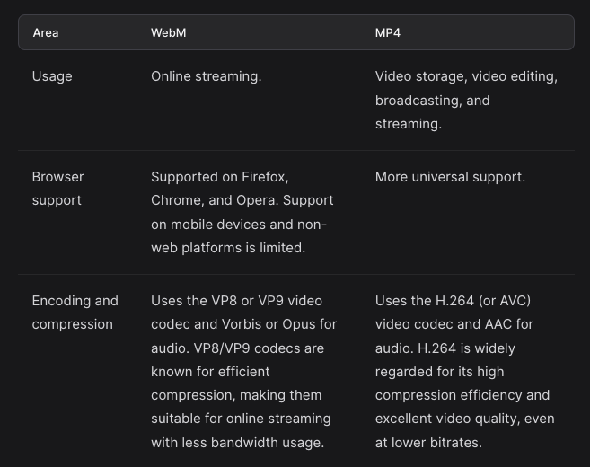
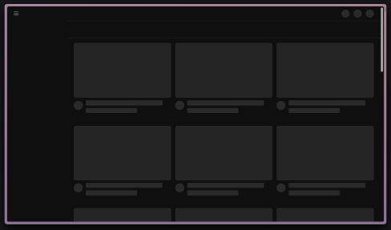
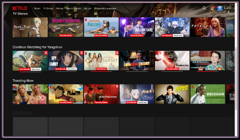
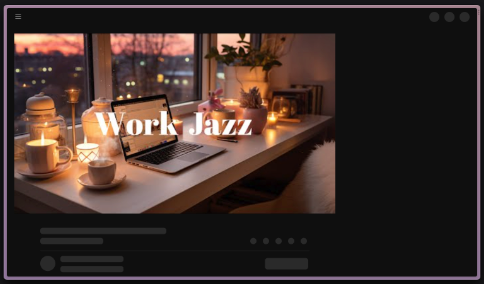
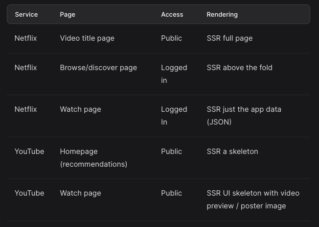
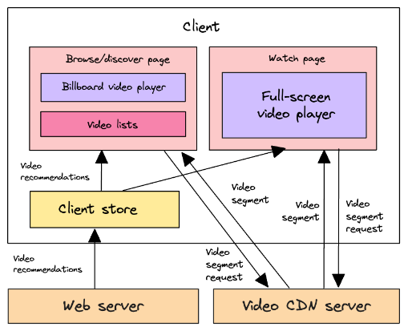
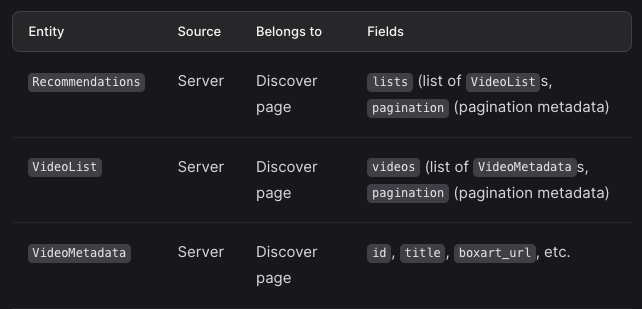
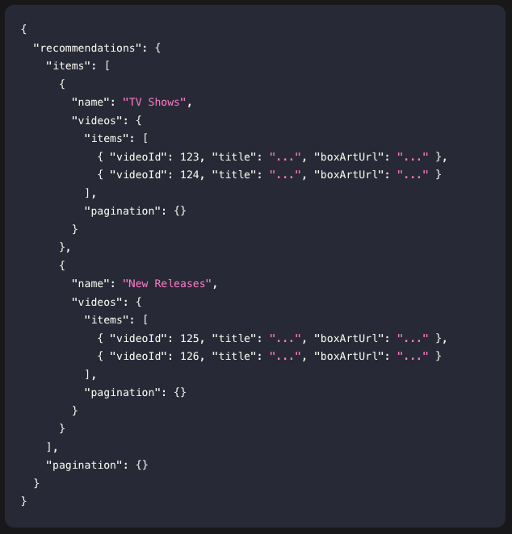
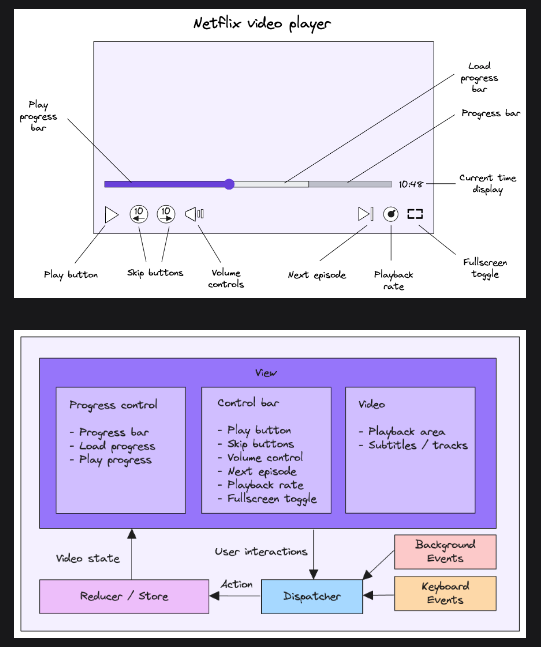

Designing a video streaming application is a common but complex system design question, but there are limited resources that provide a comprehensive guide on how to design the front end for such platforms.

## Question
Design a video streaming application similar to platforms like Netflix and YouTube that allows users to browse through a library of video content to discover interesting videos and watch videos.

### Requirements exploration
- What are the core features to be supported?
- Browsing of recommended videos on the homepage (Discover/recommendations page).
- Autoplaying billboard video at the top of the discover/recommendations page.
- Playback of video content on a standalone page.
&nbsp;
### What is the desired video playback quality and resolution?
Multiple resolutions and streaming quality options should be supported and automatically chosen depending on the device conditions.

### What functionality should the video player include?
- **Video progress**: Play, pause, skip, seeking (jumping) to a specific timestamp of the video, adjusting playback rate.
- **Audio**: Changing language, adjusting volume.
- **Subtitles**: Subtitles display and selection of subtitle languages.
&nbsp;

### What devices will the application be used on?
Primarily desktop but it should also be usable on tablet and mobile.

### What are the non-functional requirements?
Prioritize a smooth video watching experience, users shouldn't have to wait too long before they can start watching the video:

- Users on slow internet connections should still be able to watch the videos even if a lower quality version is to be served.
- Reduce stuttering and buffering.
- Fast video [startup time](https://www.mux.com/blog/the-video-startup-time-metric-explained).
&nbsp;
## Background
Since media playing on the web is a pretty specialized domain that most people would not have much experience in, we've provided a summary of the important technicalities you need to be aware of regarding video playing in the context of a system design interview. In fact, most of the contents covered here is more than expected of candidates, but it doesn't hurt to know more.

## Glossary
- **Streaming**: The process of delivering multimedia content, like video and audio, over the internet in a continuous and real-time manner. It allows users to watch or listen to the content while it is being transmitted, without the need to download the entire file before playback begins.
- **Buffering**: The process of preloading video content to ensure smooth playback, preventing interruptions due to slow network connections.
- **Bitrate**: Refers to the amount of data transferred per second in a video stream. It determines the quality and size of video files, with higher bitrates yielding better quality but larger file sizes.
- **Frame rate**: The number of video frames displayed per second, typically measured in frames per second (fps). Common frame rates include 24fps for film and 30fps or 60fps for television and online video.
- **Resolution**: Specifies the dimensions of a video in terms of width and height (e.g., 1920 x 1080 pixels for Full HD). Higher resolutions offer better visual quality but require more bandwidth.
- **Codec**: A software or hardware component that encodes and decodes video and audio data. Common video codecs include H.264, H.265 (HEVC), VP9, and AV1.
- **Bandwidth**: The amount of data that can be transmitted over a network connection in a given time frame. In video streaming, sufficient bandwidth is necessary to deliver video content smoothly and at the desired quality. Higher-quality videos with higher bitrates require more bandwidth for uninterrupted playback.
- **Poster**: Static thumbnail image of the video.
- **Closed captions** (CC): Text-based subtitles displayed during video playback, typically used for providing accessibility and language translation. They're different from subtitles but can be treated the same for the purpose of interviews.
- **Playback controls**: User interface elements for video control, including play, pause, seek, and volume.
- **Seeking**: Seeking in video playback is the action of moving to a specific point or time in the video without playing it from the beginning. Users can jump to a specific scene or timecode within the video, often by interacting with a seek bar or timeline.
- **Scrubbing**: Scrubbing is a user action that involves dragging the playhead or seek bar of a video player to navigate through the video content. It allows users to quickly move forward or backward in the video to find specific scenes or moments. 
&nbsp;

### Video playback on the web
The most basic way of playing videos on websites is to use a `<video>` HTML tag on a page with the src attribute pointing to an `mp4` or `webm` file, just like the `` tag. However, this most basic way of playing videos on a webpage doesn't offer the best user experience as they do not support adaptive bitrates.

1. **Sophisticated** video players on Netflix and YouTube leverage the following key components:
2. **Player interface**: This includes the user interface of the video player, which provides controls like play, pause, and volume adjustment. Browsers offer a basic playback controls UI but often you'd want to have more control over the styling and appearance.
3. **Streaming protocol**: Streaming involves progressively downloading a large video file that has been split into smaller segments. The player downloads and plays these segments in sequence, maintaining a buffer to handle network fluctuations. Common streaming protocols are HTTP Live Streaming (HLS) and Dynamic Adaptive Streaming over HTTP (DASH).
4. **Manifest file**: Manifest files guide the video player to the location of video segment files. They include a master manifest, which is the first point of contact and directs the player to various renditions of the video, and rendition manifests for each specific video quality. The format of the manifest files differ depending on the streaming protocol used.
5. **Adaptive bitrate streaming**: This technique allows the player to select from different versions of a video (various resolutions and bitrates) to ensure smooth playback based on the user's internet speed. To avoid buffering, video players dynamically adjust the playback quality and use the manifest files to determine the location of the segment files for the desired quality.
&nbsp;
### Video formats
[WebM](https://www.webmproject.org/) and MP4 are common video formats and the differences between them are primarily related to their video encoding, browser support, licensing, and usage:



Like WebP, WebM is also developed by Google as a performant file format for media on the web. WebM is more suited for web-based applications with an emphasis on open-source and efficient streaming, while MP4 is a versatile format with broad device and platform support, making it a popular choice for a wide range of video applications.

## Architecture / high-level design

### Rendering approach
Video streaming applications have the following characteristics:

- Video titles are searchable via search engines. YouTube videos are mostly public while Netflix has a title page containing just the video details and some art/thumbnails ([Netflix title page](https://www.netflix.com/rs/title/80057281) example).
- Certain video watching pages are only accessible by logged-in premium users (in the case of Netflix).
- Pages are interaction heavy due to browsing of video recommendations and video playing interactions.
- Fast initial loading speed and video startup speed is desired.
&nbsp;

For pages accessible by logged-in users only, server-side rendering (SSR) will improve performance slightly but SSR is not crucial. For pages that are discoverable by search engines (public videos), SEO and hence SSR will be important.

YouTube SSRs a basic skeleton of their browse/discover page.



Netflix SSRs the entire video title page.

For watch pages, especially in the case of Netflix where the video fills up the entire page, SSR is not as useful. The SSR-ed HTML doesn't include a loaded video or any buffered data needed to start playback and JavaScript is required for video streaming playback anyway.



YouTube SSRs a static preview of the video (poster image) while Netflix does not SSR anything visible.



However, Netflix's initial HTML contains data needed by the React application to boot up the video player on the page. If this data is not present in the initial HTML, the page needs to make a request to fetch the data, which requires an extra roundtrip and will be slower.



As seen from the table, there's no hard and fast rule here. YouTube SSRs only the skeleton for their pages. Netflix SSRs public pages and the browse page because it improves user engagement. SSR can be used for video listing pages which benefit from high user engagement. For video watching pages, SSR is less important and CSR can be used.

## Single-page application (SPA) or Multi-page application (MPA)?
As video streaming websites are highly interactive and navigation between discovery pages and watch pages can be pretty common (especially when the user is still choosing a video), persisting the data fetched on the discovery page across page navigations will improve the performance. Moreover, on SPAs, clients can prefetch the metadata needed by subsequent watch pages, improving the video startup time.

Netflix and YouTube are both single-page applications.

## Component responsibilities


- **Server**: Provides HTTP APIs to fetch video recommendations and video object metadata.
- **Video CDN server**: CDN server to fetch video contents itself. Allows individual fetching segments of the video.
- **Client store**: Stores data needed across the whole application. Most of the data in the store will be server-originated data needed by the video recommendations page. Persists data across navigation so that revisiting the recommendations page will not require fetching of the recommendations list again.
- **Discover page**: The page that users use to browse the recommended videos.
  - **Billboard video player**: Featured video at the top that plays immediately when the page is loaded.
  - **Video lists**: List of video categories. Each category shows a horizontal list of video thumbnails.
- **Watch page**: The page that users watch a full video.
  - **Full-screen video player**: Plays the video and contains video playback controls.
 
The video player components (purple boxes) on each page will make requests to the video CDN server to fetch video segments in a streaming fashion.

## Data model



The video recommendations should be stored in the client store which is preserved across page navigations. This acts as a cache to allow presenting of the video recommendations immediately (without a network request) whenever the user goes back to the "Discover page" to browse more recommendations.

Video players contain standalone data models and APIs, which will be covered in a dedicated section below.

## Interface definition (API)

### Video recommendations API
This API is used on the browse/discovery page to render the list of video categories and the top videos within each category. Cursor-based pagination can be used to fetch more recommendation categories and  more category videos.



Both offset-based pagination and cursor-based pagination can be used.

The data for the first page of recommendations and videos:

1. Is used to SSR the initial HTML (refer to image in rendering approach section).
2. Rendered as JSON data within `<script>` tags and is injected into the client store (`window.netflix.reactContext`).

Data for subsequent pages is fetched from a HTTP API and added into the client store, which is then added to the page's DOM.

### Media streaming and subtitles API
The APIs for streaming of the video data, audio data, and subtitles for a video depend on the selected streaming protocol (DASH, HLS) which is covered in more detail below.

### Video player API
Video players are covered in a dedicated section below.

## Video player data model, architecture, and API
As a video player involves multiple properties (state), lots of actions resulting in state changes, and many components which rely on the central video player state, a unidirectional reducer + actions pattern is appropriate. This can be implemented using `useReducer` in React or React + Redux where Redux provides more structure around the actions and reducers along with additional devtools for an enhanced developer experience.



- **View** (UI Components): Progress control, Control bar, Media
- **State** (naming may differ from actual DOM properties): Player state, Buffered frames, Current time, Duration, Playback rate, Current timestamp, Volume, Muted, Audio language, Subtitle language, Audio tracks, Video tracks, Subtitles / text tracks, Poster, Height, Width
- **Dispatcher**: Dispatches an action to the reducer. Alternatively, clients can directly dispatch the actions from within the UI components or event handlers.
- **Actions**: Play, Pause, Skip, Seek, Adjust volume, Mute, Toggle full screen
- **Keyboard events** resulting in actions:
  - Space -> Play/Pause
  - Volume key -> Adjust volume
  - Mute key -> Mute sound
  - Arrow keys -> Skip
  - Full screen shortcut -> Toggle full screen
- Background events: `loadstart`, `loadeddata`, `ended`, `error`, `stalled`, `waiting`, etc. [See the full list of events available on the `<video>` element.](https://developer.mozilla.org/en-US/docs/Web/HTML/Element/video#events)

&nbsp;
A [Flux-like unidirectional flow model](https://facebookarchive.github.io/flux/docs/in-depth-overview/) works well here. In a reducer pattern, `newState = reducer(action, state)`. Actions are operations that mutate state. A list of actions, known operations that can modify state, is defined. The only way to change the state is to dispatch an action, there is no way to update the state directly. This helps to centralize state mutation logic within the reducer.

Actions can also originate from different sources – they can be triggered from various UI elements, keyboard events, or background events. The reducer does not need to care about where the actions were dispatched from, it simply has to take in an action + current state and return the new state.

YouTube experienced performance issues due to its player video controls being over-componentized and certain interactions caused extra style recalculations due to circular dependencies and memory leaks. To fix the issue, YouTube updated the video player to synchronize all updates by refactoring the player to a top-level component that would pass down data to its children. This ensured only one UI update (paint) for any state change, eliminating chained updates. Although YouTube does not use React or Redux, this refactoring is essentially an implementation of the Flux-like reducer pattern. Source: [Building a Better Web - Part 1: A faster YouTube on web](https://web.dev/case-studies/better-youtube-web-part1).
In 2018, Netflix rewrote their video player to React and Redux, they chose to use Redux in order to single-source and encapsulate the complex playback business logic. Redux is a well-known library/pattern in web UI engineering, and it facilitated separation of concerns in ways that met their goals. By combining Redux with data normalization, they enabled parallel development across teams in addition to providing standardized, predictable ways of expressing complex business logic. Source: [Modernizing the Web Playback UI. Since 2013, the user experience of… | by Netflix Technology Blog](https://netflixtechblog.com/modernizing-the-web-playback-ui-1ad2f184a5a0).

Buffered video data can be cached, especially for the billboard video which doesn't change across the session. However, clients should pay attention to the amount of buffered video data and release memory when it reaches the point where page performance is affected.

Media players inherently contain state as well because `HTMLVideoObjects` in the DOM contain properties like `paused`, `muted`, etc. By building your own video player component in JavaScript, there will be state values that are duplicated and with duplication, values can go out-of-sync. The recommended approach is to let the UI component state be the source of truth and sync the component state with the DOM media player state, essentially making the media player a "controlled" component similar to how `<input>` elements are controlled in React.

Here are some libraries that provide custom video players or help you build one:

- [**Shaka Player**](https://github.com/shaka-project/shaka-player): An open-source JavaScript library for adaptive media that supports DASH and HLS.
- [**Video.js**](https://videojs.com/): Similar to Shaka Player, with many different themes and skins.
- [**Media Chrome**](https://www.media-chrome.org/): Elements for building media players.

### Tutorials:

- [Mobile Web Video Playback | Articles | web.dev](https://web.dev/articles/media-mobile-web-video-playback)
- [Building a Media Player Series | Chrome for Developers](https://www.youtube.com/watch?v=--KA2VrPDao&list=PLNYkxOF6rcIBykcJ7bvTpqU7vt-oey72J&index=21)

&nbsp;
## Optimizations and deep dive
### Understanding native HTML `<video>` elements
HTML5 provides a `<video>` tag to play a video within a webpage. It was introduced with HTML5 and represents a significant improvement in web standards, allowing direct embedding of videos without the need for external plugins like Flash. In this section we introduce some basics about the `<video>` tag.

#### Progressive downloading
The simplest way to render a video is similar to images, where the src attribute is pointing to a video file.

`<video src="movie.mp4" />`

This method of using the `<video>` tag with a `src` attribute pointing to a video file is called "progressive downloading". In progressive downloading, the video file is downloaded from the server in a linear fashion and played simultaneously. Unlike streaming, where only the necessary parts of the video are sent to the user, progressive download involves downloading the entire file, starting from the beginning. The video can be played as soon as enough data has been downloaded to ensure uninterrupted playback. This method is simpler than true streaming but requires more bandwidth and storage, as the entire video file is downloaded, regardless of whether the user watches it to the end. This gives an appearance similar to streaming but isn't true streaming in the technical sense.

Seeking can be achieved by using a [HTTP `Range` request](https://developer.mozilla.org/en-US/docs/Web/HTTP/Range_requests) to download the appropriate segment. An HTTP `Range` request asks the server to send only a portion of an HTTP message back to the client which is useful for media players because it wants to support random access of a file.

Video playing on Netflix and YouTube use streaming as opposed to progressive downloading. It is achieved through the Media Source API in combination with adaptive streaming formats like HLS and DASH and adaptive bitrate algorithms, to provide smooth streaming experiences regardless of device or network conditions. More on that below.

Video playing on Netflix and YouTube use streaming as opposed to progressive downloading. It is achieved through the [Media Source API](https://developer.mozilla.org/en-US/docs/Web/API/Media_Source_Extensions_API) in combination with adaptive streaming formats like HLS and DASH and adaptive bitrate algorithms, to provide smooth streaming experiences regardless of device or network conditions. More on that below.

### `<video>` element attributes
Supported HTML attributes include:

- `src`: Specifies the source of the video file.
- `width` and `height`: Define the size of the video player on the webpage.
- `controls`: Adds video controls like play, pause, and volume.
- `autoplay`: Causes the video to start playing as soon as it is loaded (not recommended due to user experience and bandwidth considerations).
- `loop`: Enables the video to start over again, every time it is finished.
- `muted`: Mutes the audio by default.
- `poster`: Specifies an image to be shown while the video is downloading, or until the user hits the play button.

Most of these HTML attributes become the `HTMLVideoElement`'s properties in the DOM when the HTML is parsed by the browser.

The `<video>` element also allows specifying multiple video sources via the `source` tag so that the browser can pick the format that works best. This is done to ensure compatibility across various browsers, as not all browsers support the same video formats.

 ```html
 <video width="320" height="240" controls>
  <source src="movie.webm" type="video/webm" />
  <source src="movie.mp4" type="video/mp4" />
  <source src="movie.ogg" type="video/ogg" />
  Your browser does not support the video tag.
</video>
```

Text placed between the `<video>` tags (but outside the `<source>` tags) serves as fallback content for browsers that do not support the `<video>` tag.

### `HTMLVideoElement` methods
The `HTMLVideoElement` element can be manipulated using JavaScript for further interactivity. `HTMLVideoElements` inherit from the `HTMLMediaElement` interface which provides a range of methods that allow for controlling and interacting with media elements like `<audio>` and `<video>` in HTML. Some of the important methods available on the `HTMLMediaElement`:

- `play()`: This method is used to start playing the media. If the media is already playing, this method has no effect. If playback is paused, it will resume.
- `pause()`: This method pauses the media playback. If the media is already paused, this method has no effect.
- `load()`: This method is used to reset the media element and reload the source media. It's useful when the source of the media has changed.
- `addTextTrack()`: Adds a new text track to the media element. This can be used for subtitles, captions, descriptions, chapters, or metadata.
- `fastSeek()`: This method allows for fast seeking to a specific time point in the media.

&nbsp;
### `HTMLVideoElement` events
The `HTMLVideoElement` inherits from the `HTMLMediaElement` interface which provides a range of events that allow developers to monitor and control media playback. These events are crucial for creating interactive and responsive media experiences on web pages.

Here are some of the important events associated with `HTMLMediaElement`:

- `loadstart`: Fired when the browser starts looking for the media; beginning of the loading process.
- `loadeddata`: Triggered when the first frame of the media has finished loading and is ready to play.
- `progress`: Fired periodically as the browser loads the media. Useful for showing media loading progress.
- `play`: Triggered when the media playback has begun or resumed.
- `playing`: Fired when the media actually begins to play after being paused or stopped for buffering.
- `pause`: Occurs when the media playback is paused.
- `ended`: Triggered when playback has stopped because the end of the media was reached.
- `waiting`: Occurs when the media playback is stopped due to temporary lack of data.
- `stalled`: Fired when there is an unexpected halt in media downloading, often due to network issues.
- `volumechange`: Occurs when the volume changes, including when the muted attribute changes.
- `error`: Fired when an error occurs while fetching the media.
These events are essential for creating a detailed control interface for media elements, handling errors, tracking progress, and responding to user interactions. By adding event listeners to these events, developers can manage media playback in a custom manner and also gather user analytics.

### Drawbacks of using `<video>`

Using "vanilla" `<video>` elements also comes with some drawbacks.

**Limited adaptive streaming support**: The `<video>` element doesn't natively support adaptive streaming protocols like DASH or HLS in all browsers. These protocols dynamically adjust video quality based on the user's internet speed, ensuring a smooth streaming experience. Without this, users may experience buffering or low-quality video. The `<video>` element might not be optimized for scenarios where low latency is crucial, such as live streaming events.

**Restricted customization and control**: `<video>` elements also contain playback controls, but like most native elements, each browser renders them differently. If you want a consistent and branded user interface across browsers you will have to build your own playback controls. However, styling these controls isn't straightforward unlike other HTML elements like `<button>`s and `<input>`s. You will have to build your own components.

Note that `<video>` elements also contain their own state as mentioned in the attributes/properties above. If you are using a JavaScript framework/library (e.g. React, Vue) and have built your own `Video` component that renders the `<video>` elements along with custom controls, you will need to do a two-way sync between your React component state and the `<video>`/`HTMLVideoElement` state as there can be native controls that directly affect the `HTMLVideoElement` like the play/pause/volume buttons (also known as media keys) on some keyboards.

**No support for advanced features**: Features like video previews, thumbnails on seek, multi-bitrate streaming, and live streaming are not natively supported or are limited in the `<video>` element.

Because of these drawbacks, it's clear that to create a world-class video streaming experience, a custom video player UI is the way to go.

## Video streaming
Now that we have a better understanding of video playback using progressive downloading and its drawbacks, we can discuss how a world-class video watching experience is achieved through video streaming.

### Media Source API
[The Media Source API](https://developer.mozilla.org/en-US/docs/Web/API/Media_Source_Extensions_API), formally known as Media Source Extensions (MSE), is a web API that enhances the capabilities of streaming media in web applications. The Media Source API allows replacing the standard single progressive `src` URI in media elements with a `MediaSource` object. This object manages the media's ready state and references multiple `SourceBuffer` objects, representing different chunks of the media stream.

```js
const videoEl = document.getElementById('my-video');
const mediaSource = new MediaSource();

// Set the MediaSource object as the source of the video element.
videoEl.src = URL.createObjectURL(mediaSource);
mediaSource.addEventListener('sourceopen', sourceOpen);

async function sourceOpen() {
  // Create a source buffer with a specific MIME type.
  const sourceBuffer = mediaSource.addSourceBuffer(
    'video/mp4; codecs="avc1.64001E"',
  );

  sourceBuffer.addEventListener('updateend', () => {
    // Check if the media source has ended and if there are more segments
    // You can fetch and append additional segments.
    if (!sourceBuffer.updating && mediaSource.readyState === 'open') {
      mediaSource.endOfStream();
    } else {
      // Fetch next segment.
    }
  });

  // Fetch the first segment of the video.
  const response = await fetch('path/to/your/video/segment1.mp4');
  const segment = await response.arrayBuffer();
  // Append the fetched segment to the source buffer.
  sourceBuffer.appendBuffer(segment);
}
```

Segmented video files, along with the Media Source API, allows for clients to stream video content. This API also allows for the creation of more interactive video experiences, such as the ability to insert ads dynamically, switch between multiple video angles, or synchronize additional content with video playback. [Netflix's Bandersnatch](https://postperspective.com/netflixs-black-mirror-bandersnatch-lets-viewers-choose/) is an interactive film with 5 unique endings where users can "choose their own adventure" while watching. As such, the number of combinations is huge and it is not feasible to create video files for all possible film paths. Using MediaSource helps to dynamically stitch the different parts of the film together depending on the user's choice.

If you inspect the `src` attribute of `<video>` elements on Netflix and YouTube, you'll see that they look like <`video src="blob:https://www.netflix.com/b4bc251f-5b0d-47a3-b0cb-4fbf653a16f4">`. This is because the src was created using `URL.createObjectURL()`.

Read more about Media Source API on:

- [Media Source API | Articles | web.dev](https://web.dev/articles/media-mse-basics)
- [Media Source API | MDN](https://developer.mozilla.org/en-US/docs/Web/API/Media_Source_Extensions_API)

Now we know how video streaming works, but that's not all there is to know! Streaming can be further improved with adaptive bitrate streaming.

### Adaptive Bitrate Streaming
While streaming helps to improve the video playback experience, it does not take into account the client's device and network conditions. If a user is on a choppy mobile network, they will not be able to watch a high resolution video immediately as they will have to wait longer for the segments to be downloaded. Users on mobile devices also do not benefit from high resolution videos when their screen size is not wide enough to display all the details.

**Adaptive Bitrate Streaming** is a technique used in online video and audio streaming that dynamically adjusts the quality of a video to suit the available bandwidth and processing capabilities of the user's device.

Clients use an adaptive bitrate (ABR) algorithm to automatically select the segment with the highest bitrate possible that can be downloaded in time for playback without causing stalls or re-buffering events in the playback.

These factors are monitored in real-time and used by the algorithm:

- Available bandwidth
- Available codecs
- Connection quality
- Video player dimensions
- Playback rate

This decision is made dynamically as the video plays, adapting to changing network speeds.

### Media Capabilities API
The [Media Capabilities API](https://developer.mozilla.org/en-US/docs/Web/API/Media_Capabilities_API) allows websites to get more information about the client's video decode performance and make an informed decision about which codec and resolution to deliver to the user.

[YouTube used the Media Capabilities API](https://web.dev/case-studies/youtube-media-capabilities) to prevent their adaptive bitrate algorithm from automatically selecting resolutions that a device could not play smoothly.

### Streaming protocols
There are two popular streaming protocols that are used on the web that can be used to enable adaptive bitrate streaming: **Dynamic Adaptive Streaming over HTTP (DASH)** and **HTTP Live Streaming (HLS)**.

These streaming protocols have the following in common:

- **Segmented media files**: Media content of various quality is divided into small segments, enabling seamless streaming and the ability to switch between different quality streams.
- **HTTP-based delivery**: They utilize standard HTTP web servers for media delivery, simplifying distribution and reducing the need for specialized streaming servers. Using HTTP to fetch files moves much of the logic from the network protocol to the client-side application so media can also be streamed from static CDNs like Amazon S3.
- **Manifest files**: Each protocol uses a type of manifest file (like MPD for DASH, M3U8 for HLS) to provide information about the available streams, their resolutions, bitrates, and segment locations (URLs).

### Dynamic Adaptive Streaming over HTTP (DASH)

Dynamic Adaptive Streaming over HTTP (DASH) is a streaming protocol and technology that allows for the efficient delivery of multimedia content, such as video and audio, over the internet. DASH is designed to optimize the viewing experience for users by adapting to their network conditions and device capabilities in real-time.

Additional features of DASH:

- **Media Presentation Description (MPD)**: DASH relies on an XML-based manifest file known as the [Media Presentation Description (MPD)](https://ottverse.com/structure-of-an-mpeg-dash-mpd/). The MPD contains metadata about the video content, including information about available quality levels, segment URLs, and other attributes that guide the video player in making adaptive streaming decisions.
- **Latency control**: DASH can be designed to control latency based on specific use cases. Low-latency DASH (LL-DASH) is an extension that optimizes the protocol for live and interactive streaming applications.
- **Interoperability**: DASH is designed for interoperability across different devices and platforms. As a result, it's possible to use the same DASH-encoded content for various playback environments.

DASH is commonly used by many streaming services, including popular platforms like Netflix, YouTube, and Amazon Prime Video, to provide a high-quality streaming experience to users. It helps ensure that users receive the best possible video quality while adapting to changing network conditions, device capabilities, and screen sizes. This technology has played a significant role in improving the reliability and performance of online video streaming.

The [dash.js](https://reference.dashif.org/dash.js/) library is a reference client implementation for the playback of DASH via JavaScript and compliant MSE platforms.

### HTTP Live Streaming (HLS)
HTTP Live Streaming (HLS) is a streaming protocol and technology developed by Apple for the delivery of multimedia content, such as video and audio, over the internet. HLS is widely used for streaming video content, especially on iOS devices (iPhones and iPads), as well as in web browsers and other platforms.

Additional features of HLS:

- **M3U8 playlist files**: HLS uses M3U8 playlist files, which are text-based manifest files that describe the media content and provide information about available quality levels, segment URLs, and other attributes. The playlist files are hosted on the server and are used by the client (the video player) to request and play the media content.
- **Media encryption**: HLS can support media content encryption using various encryption methods to protect content from unauthorized access. This can include methods like Advanced Encryption Standard (AES) encryption.
- **Compatibility**: HLS is compatible with a wide range of devices, including iOS devices, web browsers, Android devices, smart TVs, and more. Many media players and streaming platforms support HLS.
- **Low latency mode**: In more recent versions, HLS has introduced low latency modes to reduce the delay between live events and user reception, making it suitable for real-time streaming, including live sports and online gaming.
- **Adaptive streaming servers**: To implement HLS, specialized media servers are often used, such as Apple's macOS-based HTTP Live Streaming tools, or third-party servers like Wowza Streaming Engine and Nginx with the `ngx_http_hls_module`.

HLS has become a de facto standard for streaming video content, especially in the world of online video services and live streaming. It is widely adopted due to its compatibility with iOS devices and its adaptive streaming capabilities, which help ensure a high-quality viewing experience for users across different network conditions and device types.

An M3U8 file can describe multiple video qualities, allowing the player to switch between different streams based on network conditions or user preferences. This is a key feature of adaptive streaming in HTTP Live Streaming (HLS). Here's an example of an M3U8 playlist with multiple video qualities:

### Manifest file
The manifest file is a critical component that provides essential information about the video content, allowing the video player to properly play the video. The manifest file guides the video player on how to request and display the video segments.

There are different types of manifest files used in various streaming protocols, such as:

- **DASH**: In DASH, the manifest file is known as the [Media Presentation Description (MPD)](https://www.brendanlong.com/the-structure-of-an-mpeg-dash-mpd.html) file. This file, typically in XML format, contains information about the available quality levels, segment URLs, and other attributes necessary for the video player to request and play the content.
- **HLS**: For HLS, the manifest file is known as the Media Playlist or M3U/M3U8 file. It is a plain text file with an `.m3u8` extension that contains metadata and URLs to video segments.

It is not important to know the exact format of the manifest files, but you should know what details they contain. Manifest files contain details about the video stream, such as:

- **Available quality levels**: Information about different bitrates and resolutions available for the video, allowing the player to choose the appropriate quality based on network conditions.
- **Segment URLs**: Links to individual video segments or chunks. These segments make up the complete video and are requested by the player as needed for playback.
- **Playback timing and structure**: Details on the sequence and duration of segments, allowing the player to organize and play them in the correct order.
- **Adaptive streaming information**: Information that enables adaptive streaming, ensuring the player can switch between different bitrates or resolutions based on network conditions.
- **Audio and subtitle tracks**: Information about alternative audio tracks and subtitle options available for the video.

The manifest file is crucial in facilitating the adaptive streaming process and enabling the player to fetch and play the video segments as needed, allowing for a smoother and uninterrupted viewing experience. It essentially serves as a guide for the player, providing the necessary information to request and present the video content.

Netflix primarily uses a proprietary adaptive bitrate streaming technology based on DASH and is similar to other adaptive streaming protocols like HLS, but with some unique features and optimizations tailored to Netflix's large-scale streaming service. Netflix optimizes its streams not only for the user's bandwidth but also for the type of content (like action vs. dialogue-heavy films) and the device being used (smart TVs, smartphones, tablets, etc.). YouTube uses DASH but supports HLS for certain applications, such as on Apple devices where HLS is more prevalent.

Here's a simplified example of what an MPD file used for DASH might look like:

```html
<MPD xmlns="urn:mpeg:dash:schema:mpd:2011" type="static" mediaPresentationDuration="PT6M16S" minBufferTime="PT1.5S">
  <Period start="PT0S">
    <AdaptationSet mimeType="video/mp4" segmentAlignment="true" startWithSAP="1">
      <Representation id="video_1" width="1920" height="1080" bandwidth="8000000" codecs="avc1.640028">
        <SegmentTemplate media="video_1_$Number$.m4s" initialization="video_1_init.m4s" duration="4" timescale="1" startNumber="1"/>
      </Representation>
      <Representation id="video_2" width="1280" height="720" bandwidth="4000000" codecs="avc1.64001f">
        <SegmentTemplate media="video_2_$Number$.m4s" initialization="video_2_init.m4s" duration="4" timescale="1" startNumber="1"/>
      </Representation>
      <!-- More Representations for different resolutions and bitrates -->
    </AdaptationSet>
    <AdaptationSet mimeType="audio/mp4" lang="en">
      <Representation id="audio_1" bandwidth="128000" codecs="mp4a.40.2">
        <SegmentTemplate media="audio_1_$Number$.m4s" initialization="audio_1_init.m4s" duration="4" timescale="1" startNumber="1"/>
      </Representation>
      <!-- More Representations for different audio qualities -->
    </AdaptationSet>
  </Period>
</MPD>

```

In this example, the MPD file describes a video with two video quality options (1080p and 720p) and one audio track. Each `Representation` element provides details about a specific version of the content, including resolution, bitrate, codec, and the naming pattern for the segment files (`SegmentTemplate`). The client player uses this information to select the most appropriate stream based on current playback conditions.

Used in HLS, an M3U8 file can describe multiple video qualities, allowing the player to switch between different streams based on network conditions or user preferences. Here's example of an M3U8 playlist with multiple video qualities:

```
#EXTM3U
#EXT-X-STREAM-INF:BANDWIDTH=800000,RESOLUTION=640x360
http://example.com/low.m3u8
#EXT-X-STREAM-INF:BANDWIDTH=1400000,RESOLUTION=960x540
http://example.com/medium.m3u8
#EXT-X-STREAM-INF:BANDWIDTH=2800000,RESOLUTION=1280x720
http://example.com/high.m3u8
#EXT-X-STREAM-INF:BANDWIDTH=5000000,RESOLUTION=1920x1080
http://example.com/hd.m3u8
```

And an example of what `http://example.com/low.m3u8` can contain:

```
#EXTM3U
#EXT-X-VERSION:3
#EXT-X-TARGETDURATION:10
#EXT-X-MEDIA-SEQUENCE:0

#EXTINF:10.0,
http://example.com/low/segment0.ts
#EXTINF:10.0,
http://example.com/low/segment1.ts
#EXTINF:10.0,
http://example.com/low/segment2.ts

#EXT-X-ENDLIST
```

Note that the `.ts` extension is an MPEG-2 Transport Stream file, which contains a segment of the media stream. It's not a TypeScript file!

### Resources
- [**Setting up adaptive streaming media sources**](https://developer.mozilla.org/en-US/docs/Web/Media/Audio_and_video_delivery/Setting_up_adaptive_streaming_media_sources) - Developer guides
- [**How Netflix Pioneered Per-Title Video Encoding Optimization**](https://streaminglearningcenter.com/encoding/how-netflix-pioneered-per-title-video-encoding-optimization.html) - Streaming Learning Center

### Subtitles / Closed Captions

Subtitles and closed captions both provide on-screen text to accompany video content, but they serve different purposes and audiences:

Subtitles are primarily intended for users who can hear the audio but do not understand the language spoken in the video. Typically, subtitles only include the dialogue or spoken words, and not much beyond that. They are used by people who are not deaf or hard of hearing.

Closed captions are designed for users who are deaf or hard of hearing. Closed captions include not only the dialogue but also other relevant parts of the soundtrack such as sound effects, background noises, and music cues. They also indicate who is speaking or note significant sounds. They are particularly helpful for those who cannot hear the audio in the video.

The differences are subtle but it is useful to know the them. From here on, we will refer to subtitles as a general term to mean on-screen text that accompanies video content.

### Separate subtitles files
Subtitles are often provided in separate files that are downloaded and displayed along with the video. The most common subtitle file formats include:

- **SubRip Subtitle (SRT)**: A simple and widely supported format that contains timestamped text.
- **Timed Text Markup Language (TTML)**: An XML-based format for captions and subtitles.
- **Scenarist Closed Caption (SCC)**: A format used for closed captions and captions for broadcast video.
- **WebVTT (VTT)**: A format that offers more styling options and is commonly used for HTML5 video. You can use the `<track>` element within the HTML5 `<video>` element to reference a WebVTT file, and the browser handles the rendering of subtitles.

```html
<video controls>
  <source src="video.mp4" type="video/mp4" />
  <track
    label="English"
    kind="subtitles"
    srclang="en"
    src="subtitles.vtt"
    default />
</video>
```

### Embedded subtitles
In some cases, subtitles are embedded directly into the video file itself. This method is common for broadcast and streaming video formats like DVB, ATSC, and some streaming protocols. The subtitles are decoded and displayed by the video player.

DASH and HLS support delivering subtitles as part of the streaming package. The subtitles are included in the manifest files and can be selected by the user through the video player.

### Separate API
Some web video player libraries offer APIs that allow developers to dynamically load subtitles from external sources or services. This can be useful for applications where subtitles change based on user preferences or dynamic content.

### Accessibility features
When displaying subtitles, it's important to ensure that they are accessible to all users, including those with disabilities. This involves providing proper markup and interaction support for screen readers and keyboard navigation. It also includes enabling users to customize the appearance of subtitles, such as font size and color, to improve readability.

In addition to spoken dialog, subtitles and transcripts should also identify music and sound effects that communicate important information. This includes emotion and tone:

```14
00:03:14 --> 00:03:18
[Dramatic rock music]

15
00:03:19 --> 00:03:21
[whispering] What's that off in the distance?
```

### Multiple language support
To cater to a global audience, video players typically allow users to select from multiple languages and subtitle tracks, making it possible to switch between different languages or caption styles.

### Resources
- [Implementing Japanese Subtitles on Netflix | by Netflix Technology Blog](https://netflixtechblog.com/implementing-japanese-subtitles-on-netflix-c165fbe61989)
- [Web Video Text Tracks Format (WebVTT) - Web APIs | MDN](https://developer.mozilla.org/en-US/docs/Web/API/WebVTT_API)
- [Subtitles, Captions, WebVTT, HLS, and those magic flags | Mux](https://www.mux.com/blog/subtitles-captions-webvtt-hls-and-those-magic-flags)
- [Adding captions and subtitles to HTML video - Developer guides | MDN](https://developer.mozilla.org/en-US/docs/Web/Media/Audio_and_video_delivery/Adding_captions_and_subtitles_to_HTML5_video)
- [WebAIM: Captions, Transcripts, and Audio Descriptions](https://webaim.org/techniques/captions/)

## Performance

Performance in video streaming is vital for a seamless and enjoyable viewing experience, free from buffering and quality issues. For businesses, high performance in streaming is critical for customer retention, brand reputation, and efficient bandwidth usage, which impacts operational costs and scalability.

Minimizing latency and delay
- **Video loading time**: Reduce video loading times to minimize buffering delays. Use adaptive streaming techniques to deliver the appropriate quality based on the user's network conditions.
- **Buffering optimization**: Optimize video buffering to provide smooth playback. Preload video content where possible, and use efficient buffering algorithms. Buffer ahead of the current timestamp.
- **Network efficiency**: Leverage adaptive bitrate streaming to adjust video quality based on the user's available bandwidth. This ensures that users with slower connections can still watch videos (albeit at a lower quality) without frequent buffering.
- **Video compression**: Use modern video compression codecs (e.g., H.264, H.265, VP9) to minimize the size of video files, reducing the amount of data that needs to be transferred over the internet.
- **CDN usage**: Utilize Content Delivery Networks (CDNs) to serve video content from servers located closer to users, reducing latency and improving playback performance.
- **Lazy loading**: Implement lazy loading for videos so that they only load when they come into the user's viewport. Lazy load non-visible UI like dropdowns and modals during idle cycles or when it's being interacted with. This reduces initial page load times.
- **Player responsiveness**: Ensure that video player controls and the user interface remain responsive during video playback. Users should be able to interact with the player without delays.
- **Preloading media files**: Preload media either by using the preload attribute (only for predefined src, not compatible with Media Source API) or use link preload ([source](https://web.dev/articles/fast-playback-with-preload)).

### Improving video startup time by separating video lifecycle from UI lifecycle
The conventional approach of allowing the UI component tree to control the lifecycle of video playback can lead to a sluggish user experience. This is primarily due to the dependency on UI lifecycle methods, like those in React, where video initiation is tied to specific component calls, causing users to wait until the playback is sufficiently loaded before viewing the content.

A more efficient alternative involves separating the logic for managing video playback from the UI component tree. This allows the execution of video-related processes from any point within the application, including before the UI tree is rendered during the initial application loading. By initiating video creation in parallel with UI rendering, the application gains valuable time to create, initialize, and buffer video playback. Consequently, this approach enables users to start playing the video sooner, enhancing the overall responsiveness and user experience.

*Source: [Modernizing the Web Playback UI | by Netflix Technology Blog](https://netflixtechblog.com/modernizing-the-web-playback-ui-1ad2f184a5a0)*

#### Image optimizations

- **Preload poster image**: `<link as="image" rel="preload" href="poster.jpg" fetchpriority="high">`.
- **Video thumbnails**: Optimize the generation and display of video thumbnails, which can contribute to faster loading times and improve the user experience when seeking through a video.
- **Responsive images**: Use responsive thumbnail images to load images of the suitable dimensions for the current device.
#### Bandwidth efficiency

- **Selective autoplay**: When opening a video in a new tab, YouTube does not start playing the video until the tab is in focus.
- **Non-visible tabs**: Only audio data needs to be streamed when the tab is in the background and not visible.
- **Buffer sufficiently but not excessively**: Don't buffer more than necessary, especially if the video is paused as the user might not intend to resume watching.

#### Memory usage
Video watching requires pages to be long-lived, so it is important to pay attention to memory usage and efficiency.

- **Memory usage**: Minimize memory consumption to prevent performance degradation over time, especially on devices with limited RAM. Not streaming video data when the tab is in the background helps to lower the amount of data in the buffer, thereby keeping memory usage low.
- **Resource cleanup**: Properly release resources, including video buffers and memory, when a video is no longer needed to prevent memory leaks and performance issues.

### User experience
A positive user experience in video streaming is crucial as it ensures user satisfaction and engagement from the user's perspective. For businesses, it translates into higher user retention, brand loyalty, and potential revenue growth, as satisfied users are more likely to recommend the service and continue their subscriptions.

### Ease of use
- **Playback controls**: The player should provide essential playback controls, including play/pause, volume control, mute, and fullscreen mode. These controls should be easily accessible and responsive.
- **Consistent user interface**: Maintain a consistent and familiar user interface across different devices and platforms. Users should feel comfortable with the player's layout and controls and their positioning should conform to common standards.
- **Responsive design**: The video player should adapt to various screen sizes and orientations, ensuring that it works well on desktops, laptops, tablets, and mobile devices.
- **Seeking and scrubbing**: Ensure that seeking (moving forward or backward in the video) is easy and precise. Users should be able to scrub through the video accurately.

### Customization
- **Customization options**: Allow users to customize aspects of the player, such as subtitles, captions, video quality, and playback speed to suit their preferences.
- **Video quality settings**: Provide options for users to adjust video quality based on their internet connection and device capabilities. This can help prevent buffering issues and provide a smoother viewing experience.
- **Playback speed control**: Some users prefer to watch videos at a faster or slower speed. Include an option to adjust the playback speed to cater to individual preferences.
- **Error handling**: Display clear and informative error messages when playback issues occur, such as when the video can't be loaded or an error is encountered during playback.

### Enhanced experience
- **Prevent layout shifts**: Set the `width` and `height` attributes on `<video>` tag to [prevent layout shifts](https://web.dev/patterns/web-vitals-patterns/video/video).
- **Video thumbnail previews**: Offer video thumbnails or previews when users hover over the timeline. This helps users quickly identify specific scenes in the video.
- **Poster image**: For autoplay videos, [YouTube found that using a solid black poster image](https://web.dev/case-studies/better-youtube-web-part1#improving_core_web_vitals) for autoplay videos was a better experience because the transition from solid black to the first frame of the video to be less-jarring.

### Accessibility (a11y)
Since video streaming applications serve a broad, international audience, accessibility is vital because it ensures that all users, including those with disabilities, have equal access to content. A high standard of a11y also helps the business uphold the principles of equality and non-discrimination in digital content consumption.

### Subtitles
Accessibility for subtitles have been covered in the "Subtitles" section above. To recap:

- **Audio impairment issues**: Closed captions or subtitles should be provided for videos to assist users who are deaf or hard of hearing.
- **Implementation**: One way to implement subtitles is to use <track> tags within `<video>` tags.
- **Readability**: Ensure subtitles are easy to read, with clear fonts, appropriate sizes, and high contrast against the video in the background. Common choices are white text with a drop shadow or white text highlighted in a dark color.
- **Inclusion of non-speech elements**: Capture not just dialogue but also significant sounds and audio cues in the subtitles to provide a fuller understanding of the content.
- **Customization options**: Support the display and customization of captions, including font size, color, and background.
- **Multi-lingual support**: Subtitles should be offered in multiple languages to cater to a diverse audience with different linguistic backgrounds.

### Visual assistance
- **Contrast and color choices**: Ensure that the video player's user interface, including controls and text, meets minimum contrast ratios to make it easier to read and interact with. Avoid relying solely on color to convey important information.
- **Load progress indicator**: Display a loading progress bar or spinner to inform users that the video content is loading. This can help manage user expectations and reduce frustration.
- **Buffering indicator**: Clearly indicate when the video is buffering to manage user expectations and provide feedback on the loading process.
- **Description of site's capabilities**: Netflix describes the video's features to screen reader users.


### Screen readers
- **Buttons have labels**: Providing alternative text for video controls, offering descriptive labels for buttons (which are usually icon-only).
- **Video playback information**: Screen reader users should receive pertinent information about the video, such as title, duration, and playback status.
- **Text-to-speech compatibility**: Video players should not interfere with or disrupt assistive technologies that convert on-screen text to speech.


### Keyboard support
- **Keyboard accessibility**: Video players should be operable using keyboard navigation alone. This includes allowing users to play, pause, adjust volume, and seek through the video using keyboard shortcuts. Keyboard focus should be visible and logical.
- **Keyboard shortcuts**: Offer keyboard shortcuts for common actions, such as volume control, playback, and seeking within the video.
- **Focus management**: Maintain a clear and logical focus order, ensuring that keyboard and screen reader users can easily navigate through controls without getting stuck.


### External sources of control
- **Multiple input methods**: Ensure that the video player can be operated using a variety of input methods, including touchscreens and pointing devices.
- **External peripherals**: External peripherals can also control the media object state, the web user interface is not the only source of control. Media object's state should be synced with the UI component state so that custom-built controls can accurately reflect playback state.

*Source: [Accessible multimedia - Learn web development | MDN](https://developer.mozilla.org/en-US/docs/Learn/Accessibility/Multimedia#accessible_audio_and_video_controls)*

## Internationalization (i18n)
Internationalization concerns for a web video player involve making sure that the player is designed and developed to support users from various regions and languages.

- **Language support**: User interface should be translated into multiple languages to support a global audience. Use internationalization libraries or frameworks like `i18next` or `react-intl` to manage language translations.
- **Translated labels for buttons**: Non-visible button labels like `aria-labels` should also be translated for the user's selected language.
- **Subtitle and captioning**: Support multiple languages for subtitles and closed captions. Users from different regions may require subtitles in their native languages to fully understand the content.
- **Audio track selection**: Provide the ability for users to select audio tracks in different languages if the video offers multiple audio options, such as dubbing.
- **Region-based content**: Some content may be geographically restricted due to licensing or regional regulations. The player should handle content availability based on the user's location.
- **RTL (Right-to-Left) support**: If supporting languages with right-to-left writing systems (e.g., Arabic or Hebrew), ensure that the video player's interface adapts to RTL layout when necessary.
- **Localization of content metadata**: If the video player displays metadata about the content, such as titles and descriptions, ensure that this information can be localized and is presented accurately for different regions.
- **Content ratings and guidelines**: Some regions have specific content rating systems and guidelines. Make sure that content ratings and warnings comply with local regulations and standards.
- **Legal and compliance**: Be aware of international copyright and intellectual property laws. Ensure that the video player and content distribution comply with local regulations and licensing agreements.

## Bonus
### How to serve thumbnails when hover the seek bar
- YouTube creates low-res images for each timestamp and stitches a few frames together into a sprite sheet uploaded to a CDN. When the seek bar is hovered, a request is made to fetch the sprite sheet that contains the thumbnail for the current timestamp.
- Netflix includes the thumbnails as part of their streamed data.

### References
- [How video works](https://howvideo.works/)
- [Building a Better Web - Part 1: A faster YouTube on web](https://web.dev/case-studies/better-youtube-web-part1)
- [How YouTube improved video performance with the Media Capabilities API](https://web.dev/case-studies/youtube-media-capabilities)
- [Media Source API](https://developer.mozilla.org/en-US/docs/Web/API/Media_Source_Extensions_API)
- [UI frameworks and Media Elements](https://medium.com/axon-enterprise/ui-frameworks-and-media-elements-c0c6832528e5)
- [Modernizing the Web Playback UI | by Netflix Technology Blog](https://netflixtechblog.com/modernizing-the-web-playback-ui-1ad2f184a5a0)
- https://developer.mozilla.org/en-US/docs/Web/Media/Audio_and_video_delivery/Setting_up_adaptive_streaming_media_sources